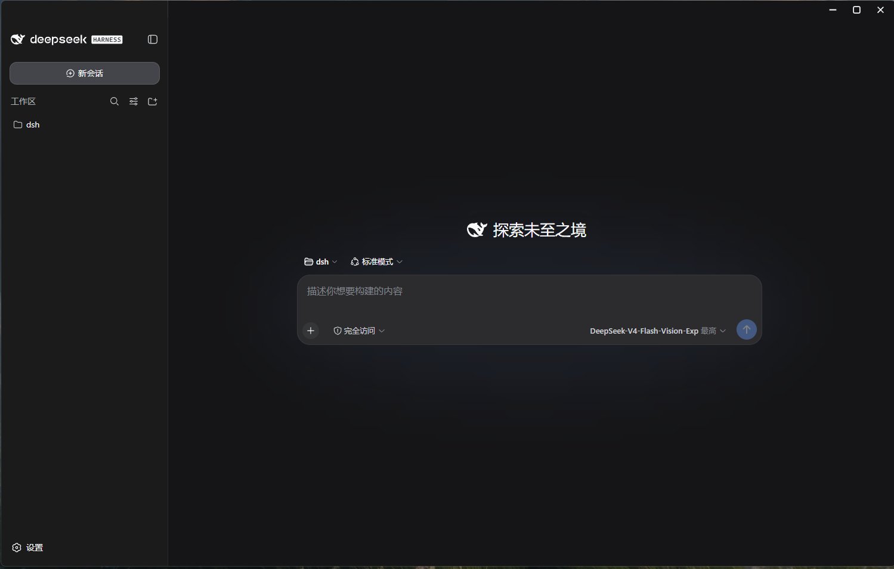
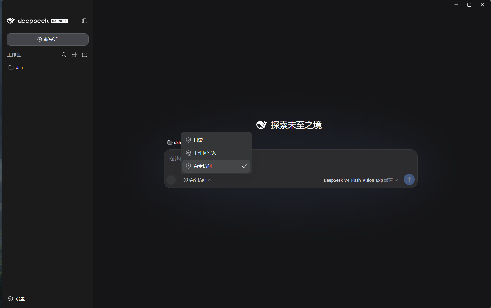
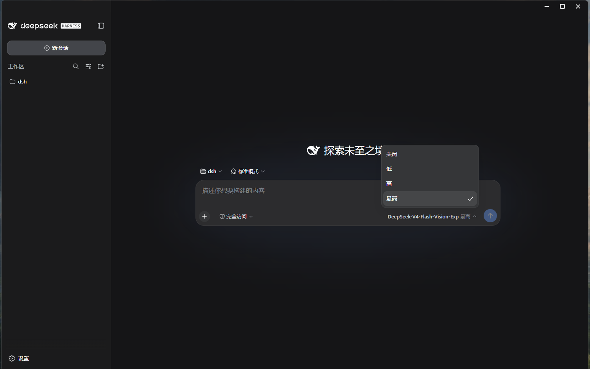
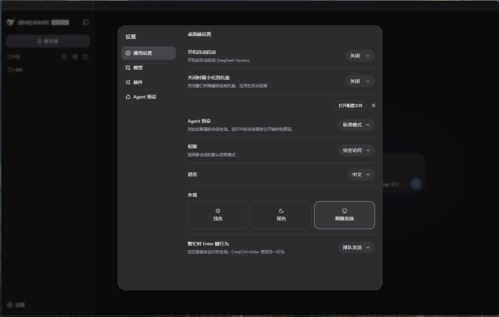

# DeepSeek Harness 桌面端 · DSH Desktop

> 基于 DeepSeek 开源「一切皆插件」（*Everything is a Plugin*）架构的本地 Agent 工作台。Electron 桌面壳 + 内置 Node.js 与 `dsh` CLI，一键启动，模型、工具、Agent 循环、UI 全部可插拔，数据不出本机。

## 简介

**DeepSeek Harness**（`dsh`）是 [DeepSeek AI](https://deepseek.com) 开源的 Agent 运行框架，核心架构是**一切皆插件**：模型适配器、工具、Agent 主循环、会话持久化、权限策略、浏览器界面，全部以 Cordis 插件组合包（bundle）按需叠加。**桌面端**（DSH Desktop）以 Electron 为壳、内置 Node.js 与 `dsh` CLI，双击即在 `http://127.0.0.1:3080` 拉起完整工作台；会话、设置、凭证、附件全部落盘 `$DSH_HOME`（默认 `~/.dsh`），本地优先。

> 当前为 developer preview，随上游迭代同步更新。

## 界面预览

| 新会话页面 | 访问权限选择 |
| --- | --- |
|  |  |

| Agent 档位 | 桌面端设置 |
| --- | --- |
|  |  |

## 架构

```
浏览器表层  Web UI（lazy-CJS 模块 + slot 注入，可插第三方 UI 组件）
宿主服务层  HTTP 服务器 / API 网关 / 信任栅栏 / 附件（sha256 内容寻址）
核心服务层  Agent 主循环 / 会话持久化 / 工具执行 / LLM / 沙箱 / 凭证
插件内核    Cordis（组合式插件内核 + Loader + HMR）
Profile 层  组合包 bundles → cordis.patch.yml → --patch 覆盖
启动器      dsh CLI（--profile / web / headless / plugin）
桌面壳      Electron（内置 Node.js + dsh CLI，托盘/自启）
```

## 核心特性

- **一切皆插件**：模型、工具、Agent 循环、会话、权限、UI 全部可组合、可替换、可扩展；
- **完整 Agent 工具箱**：Bash/PowerShell（含持久 PTY）、文件系统、Web 搜索与抓取、子代理、工作流、目标循环（goal）、规划模式、技能（skills）、MCP 外部工具接入；
- **健壮会话**：JSONL + zstd 落盘、崩溃轮次自动修复、检查点、SQLite 全文检索、自动压缩控制上下文成本；
- **模型接入**：DeepSeek 官方路由（上下文窗口 100 万、thinking/reasoningEffort 可调）+ pi-ai 通用多提供方；5 次重试、指数退避 500ms→10s + jitter；
- **Token 透明**：用量计量 + 侧边栏余额实时展示；超大工具结果自动 spill 出上下文；
- **安全可控**：三档权限预设（read-only / workspace-write / danger-full-access）、三层沙箱（bwrap / Seatbelt / Windows ACL 受限令牌）、凭证文件 0600 原子写、配置只引用密钥不携带密钥；
- **可视化 GUI**：会话时间线、Trajectory 轨迹检查器、后台任务面板、插件清单、模型与凭证管理、主题（浅色/深色/跟随系统）。

## 桌面端功能（Electron 壳）

- **纯壳封装，零改动**：窗口直接加载 `http://127.0.0.1:3080`，页面与浏览器中完全一致，不注入、不修改 Web 端代码；
- **服务静默自愈**：后台检查器每 1.5s 探测服务；不可达时按 3s→60s 指数退避自动重启，服务就绪即自动进入页面，恢复后自动刷新，全程不弹阻塞对话框；
- **完全自包含**：优先使用内置 Node.js + dsh 运行时（免装环境），也支持 npx 缓存 / npm 全局 / PATH 自动发现；
- **无边框窗口**：内置最小化 / 最大化 / 关闭三键（悬浮页头、自动对齐 Session log 胶囊），侧边栏 Logo 可拖动窗口；图片查看器等全屏弹层打开时控件自动隐藏；
- **系统托盘**：单击托盘显示主窗口，「关闭时最小化到托盘」可开关；
- **开机自动启动**：Windows / macOS 原生 API、Linux autostart 桌面项，设置页一键开关；
- **桌面端设置卡片**：在「通用设置」页注入「桌面端设置」分区（样式与官方行 1:1 对齐），设置独立持久化；
- **界面本地化**：自动移除「预览版」徽标，权限选项与推理档位英文菜单转中文（精确匹配文本节点，不改动聊天内容）；
- **安全加固**：sandbox + contextIsolation + webSecurity 全开；页面外链统一交给系统默认浏览器；
- **CI 冒烟测试**：`DSH_SMOKE_TEST=1` 启动后自动截图退出（可指定截图设置页），支持自动化验证。

## 关键默认值

| 项 | 值 |
| --- | --- |
| Web 服务 | `127.0.0.1:3080`（`--host 0.0.0.0` 被拒绝；`--trusted-host` 可放行局域网） |
| 工具并行数 | 10 |
| DeepSeek 上下文窗口 | 1,000,000 |
| 压缩触发 / 保留 | 0.8 / 0.16，摘要 ≤8192 tokens |
| goal 轮次上限 | 256（连续 3 轮受阻判定阻塞） |
| 子代理深度 / 工作流 Agent 上限 | 3 / 1000 |
| MCP 工具超时 / 重连 | 60s / 500ms→30s，10 次放弃 |
| 权限预设 | `workspace-write + ask`（默认） |

## 安装 / 快速开始

1. 从 **Releases** 下载安装包（Windows 一键安装，免配置环境），启动后自动拉起 `http://127.0.0.1:3080`；
2. **配置凭证**：设置 → Models 填入 DeepSeek API Key（默认读 `DEEPSEEK_API_KEY` 环境变量）；
3. **新建会话**：输入任务回车即开始，当前目录为默认 workspace 根；
4. 执行中实时查看思考与工具调用，需审批的工具弹出授权请求。

### CLI 参考

```powershell
dsh web                          # 启动 Web 工作台（--host / --port / --trusted-host / --no-open）
dsh --profile headless "任务"     # 一次性持久化会话，打印最终答案后退出
dsh plugin --profile web add <路径或包名>    # 安装第三方插件
dsh --profile web --dump-config  # 查看组合后的完整配置树
```

## 插件扩展开发

插件 = host 半（`cordis.patch.yml` 注入 profile）+ 浏览器半（`exports["./client"]` 出货 bundle），经 slot 系统（`ctx.slots.inject` / `register`）挂到侧边栏、设置分区、工具卡片、会话流节点：

```powershell
dsh plugin --profile web add <插件路径或包名>   # 安装（自动同步 dsh.profile.bundles）
dsh plugin --profile web remove <插件名>        # 卸载
```

> profile 变更后需重启应用生效。

## License

[MIT](LICENSE)
